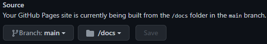

## Construindo o site
Finalmente, após a configuração, personalização e inserção da documentação, estamos aptos a construir a página. O docusaurus é um gerador de site estático, logo nós devemos gerar o site em uma pasta com conteúdo estático antes de enviar para o GitHub Pages para que possa ser acessado. Para gerar o site:
~~~bash
npm run build
~~~

Os arquivos são gerados na pasta `${RepoDir}\docusaurus\meu-site\build\`, que pode ser copiada para qualquer hospedagem de site estático como o GitHub Pages.

## Enviando a página e configurando o GitHub Pages
Primeiramente, vamos enviar todo o conteúdo da página gerada pelo docusaurus para o GitHub:
1. Crie uma pasta `docs` no diretório do repositório: `${RepoDir}\docs`. Copie **todo** o conteúdo da pasta `${RepoDir}\docusaurus\meu-site\build\` para dentro da pasta recém criada;
2. Abra o GitHub Desktop, selecione o seu repositório na parte superior esquerda (caso já não esteja selecionado);
3. Na parte inferior esquerda dê um *Commit to main* nas suas modificações:  
  
4. Após isso, dê *Push origin* para seu código ser enviado para o repositório.

Com o navegador web, acesse o seu repositório no GitHub e vá na aba "Settings". No menu lateral, acesse a opção "Pages". Defina que o código fonte da sua página está na pasta `docs`:

Pronto! Sua página estará disponível em poucos minutos agora!

O endereço do site será do tipo `https://NomeDeUsuario.github.io/nome-do-repo/`.