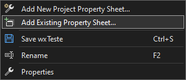
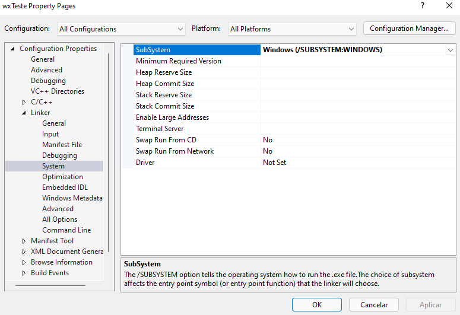

# Criar e configurar um projeto do wxWidgets

## Criando um novo projeto do wxWidgets e carregando as propriedades
Crie um novo projeto C++ em branco no Visual Studio. Para configurar o projeto, será utilizado a [planilha de propriedades](https://docs.microsoft.com/pt-br/cpp/build/create-reusable-property-configurations?view=msvc-170) fornecida pelo wxWidgets.


Acesse o gerenciador de propriedades em `View > Other Windows > Property Manager` e acesse a aba `Property Manager`. Selecione o projeto que você criou, clique com o botão direito e selecione `Add Existing Property Sheet`. Vá até a pasta `${wxDir}` e selecione o arquivo `wxwidgets.props`.



Insira o código `minimal` obtido dos arquivos de amostra do wxWidgets localizado em `${wxDir}/samples/minimal/mininal.cpp`, ou copie o código abaixo em um novo arquivo `.cpp`:

<details id="node-env">

<summary>Código mínimo</summary>


```cpp title="minimal.cpp"
/////////////////////////////////////////////////////////////////////////////
// Name:        minimal.cpp
// Purpose:     Minimal wxWidgets sample
// Author:      Julian Smart
// Modified by:
// Created:     04/01/98
// Copyright:   (c) Julian Smart
// Licence:     wxWindows licence
/////////////////////////////////////////////////////////////////////////////
#include "wx/wxprec.h"
#ifndef WX_PRECOMP
    #include "wx/wx.h"
#endif

#ifndef wxHAS_IMAGES_IN_RESOURCES
    #include "../sample.xpm"
#endif

class MyApp : public wxApp
{
public:
    virtual bool OnInit() wxOVERRIDE;
};

class MyFrame : public wxFrame
{
public:
    MyFrame(const wxString& title);

    void OnQuit(wxCommandEvent& event);
    void OnAbout(wxCommandEvent& event);

private:
    wxDECLARE_EVENT_TABLE();
};
enum
{
    Minimal_Quit = wxID_EXIT,
    Minimal_About = wxID_ABOUT
};

wxBEGIN_EVENT_TABLE(MyFrame, wxFrame)
    EVT_MENU(Minimal_Quit,  MyFrame::OnQuit)
    EVT_MENU(Minimal_About, MyFrame::OnAbout)
wxEND_EVENT_TABLE()

wxIMPLEMENT_APP(MyApp);

bool MyApp::OnInit()
{
    if ( !wxApp::OnInit() )
        return false;

    MyFrame *frame = new MyFrame("Minimal wxWidgets App");

    frame->Show(true);
    return true;
}

MyFrame::MyFrame(const wxString& title)
       : wxFrame(NULL, wxID_ANY, title)
{
    SetIcon(wxICON(sample));

#if wxUSE_MENUBAR
    wxMenu *fileMenu = new wxMenu;

    wxMenu *helpMenu = new wxMenu;
    helpMenu->Append(Minimal_About, "&About\tF1", "Show about dialog");

    fileMenu->Append(Minimal_Quit, "E&xit\tAlt-X", "Quit this program");
    wxMenuBar *menuBar = new wxMenuBar();
    menuBar->Append(fileMenu, "&File");
    menuBar->Append(helpMenu, "&Help");

    SetMenuBar(menuBar);
#else // !wxUSE_MENUBAR
    wxSizer* sizer = new wxBoxSizer(wxHORIZONTAL);
    wxButton* aboutBtn = new wxButton(this, wxID_ANY, "About...");
    aboutBtn->Bind(wxEVT_BUTTON, &MyFrame::OnAbout, this);
    sizer->Add(aboutBtn, wxSizerFlags().Center());
    SetSizer(sizer);
#endif 

#if wxUSE_STATUSBAR
    CreateStatusBar(2);
    SetStatusText("Welcome to wxWidgets!");
#endif
}


void MyFrame::OnQuit(wxCommandEvent& WXUNUSED(event))
{
    Close(true);
}

void MyFrame::OnAbout(wxCommandEvent& WXUNUSED(event))
{
    wxMessageBox(wxString::Format
                 (
                    "Welcome to %s!\n"
                    "\n"
                    "This is the minimal wxWidgets sample\n"
                    "running under %s.",
                    wxVERSION_STRING,
                    wxGetOsDescription()
                 ),
                 "About wxWidgets minimal sample",
                 wxOK | wxICON_INFORMATION,
                 this);
}
```

</details>

Ao tentar compilar o projeto, ocorrerá um erro com o *linker*. Para resolver o problema, clique com o botão direito no projeto criado e clique em  `Properties` Vá em `Linker > System > SubSystem` e altere para `Windows (/SUBSYSTEM:WINDOWS)`:



:::caution Atenção!
Para evitar problemas, na parte superior da janela de propriedades, em "Configuration" selecione `All Configurations` e em "Platform" selecione `All Platforms`.
:::

Com isso o projeto poderá ser compilado!