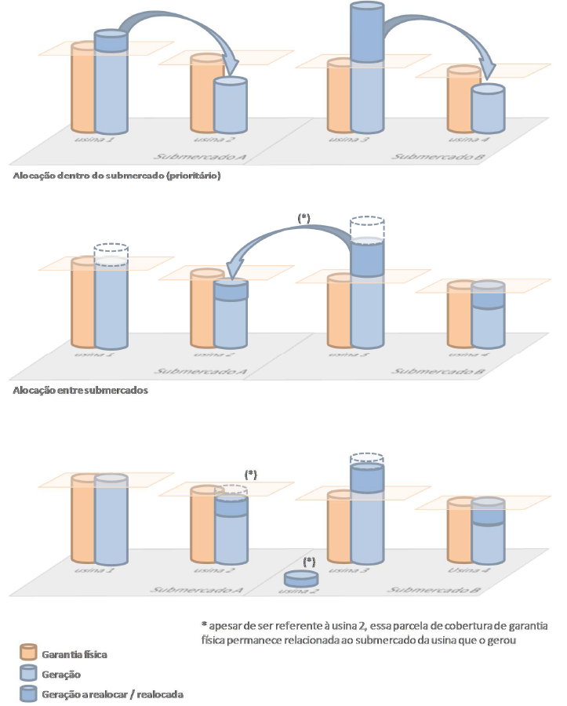

# Conceitos básicos de Mercado e Operação de Energia Elétrica
Aqui são sumarizados alguns conceitos básicos relacionados ao mercado de energia elétrica. Os conceitos são apresentados e podem ser encontrados pela ferramenta de busca ou encontrado no menu lateral.

## Mecanismo de Realocação de Energia (MRE)
O Mecanismo de Realocação de Energia é um **mecanismo financeiro** de compartilhamento dos riscos hidrológicos associados à **otimização eletroenergética do SIN** no que diz respeito ao despacho centralizado das unidades de geração de energia elétrica realizado pelo ONS. Os agentes proprietários de usinas sujeitas ao despacho centralizado pelo ONS **não tem controle sobre seu nível de geração**, independentemente de seus compromissos de venda de energia realizados com base nas garantias físicas.

:::info Garantia Física
**Quantidades máximas de energia e potência associadas ao empreendimento de geração**, incluindo importação, a ser definida pelo poder concedente e constante do contrato de concessão ou ato de autorização, que poderá ser utilizada para comprovação de atendimento de Carga ou comercialização por meio de contratos. [2]
:::

O Mecanismo de Realocação de Energia (MRE) foi concebido para compartilhar entre seus integrantes os riscos financeiros associados à comercialização de energia pelas usinas hidráulicas despachadas de modo centralizado e otimizado pelo ONS. 

Outro fator que explica a instituição do MRE é a existência de várias usinas em cascata.

:::tip Em outras palavras...
Em outras palavras, o MRE realoca a energia entre os integrantes do “mecanismo”, transferindo o excedente daqueles que geraram além de suas garantias físicas para aqueles que geraram abaixo. 
:::

### Cobertura de Garantia Física e alocação de energia
Segundo o MRE, cada gerador deverá receber, sob o ponto de vista contábil, seu nível de garantia física calculado. Essa condição deve ocorrer desde que os geradores participantes do MRE, como um todo, produzam, de maneira conjunta, energia suficiente para cobrir toda a garantia física das usinas integrantes do mecanismo.

Se o total da produção destinada ao MRE das usinas participantes for igual à garantia física do MRE, então cada usina terá alocação igual à sua garantia física calculada.

A alocação de energia das usinas com excedente de geração em relação à garantia física para aquelas que apresentaram déficit de geração em relação à garantia física é feita, prioritariamente, entre usinas localizadas em um mesmo submercado, conforme representação gráfica:

Fonte: [1]

## Programação Dinâmica Dual Estocástica (PDDE)
Proposto como uma extensão da Programação Dinâmica Dual (PDD), a Programação Dinâmica Dual Estocástica (PDDE), surgiu para tratar de problemas estocásticos multiestágio de considerável porte, baseando-se na amostragem da representação das incertezas do problema. Destaca-se também que a proposta inicial da PDDE foi aplicada a uma modelagem baseada no Planejamento de Médio Prazo da Operação hidrotérmica (PMPO) brasileiro, com horizonte de 10 estágios e representação individual de 39 hidrelétricas do SIN. Na PDDE, o número de estágios, reservatórios e realizações concebidos na modelagem do problema não inviabilizam, de maneira geral, a obtenção de políticas de operação; porém, implicam diretamente no tempo de execução do algoritmo.

Além disso, como na PDDE as políticas de operação são calculadas iterativamente, visando uma determinada amostra de cenários, não se pode garantir em que ponto da execução do algoritmo as políticas encontradas se referem à solução ótima do problema completo. Contudo, é de consenso que políticas de boa qualidade podem ser obtidas com a PDDE. Diversas propostas e discussões acerca do critério de parada do algoritmo podem ser encontradas na literatura especializada. Ainda, pode-se também encontrar trabalhos que discutem a qualidade da política encontrada para o problema modelado, em relação ao problema multiestágio estocástico real. Ademais, salienta-se que o método da PDDE é amplamente utilizado nos dias atuais e que muitos aprimoramentos envolvendo a eficiência e eficácia do algoritmo podem ser encontrados em pesquisas recentes.

Fonte: [3]

:::info
O NEWAVE é uma ferramenta de planejamento energético da operação com representação agregada do parque hidroelétrico e cálculo da política de operação, baseado na técnica de Programação Dinâmica Dual Estocástica (PDDE). [4]
:::

Esse modelo tem como objetivo determinar a estratégia de operação de médio prazo, de forma a minimizar o valor esperado do custo total de operação ao longo do período de planejamento da operação; analisar as condições de atendimento energético no horizonte de médio prazo; informar as condições de fronteira por meio da função de custo futuro para o modelo de programação de curto prazo; e calcular os custos marginais de operação mensais para cada patamar de carga.

Fonte: [4]

## Programa Mensal de Operação (PMO)
As atividades de programação da operação têm como insumo as **estratégias de operação calculadas no planejamento da operação energética**, informações atualizadas sobre o cronograma de expansão da geração e transmissão, o estado atual de armazenamento dos reservatórios, previsões atualizadas de carga de energia por patamar, a análise das condições meteorológicas verificadas e previstas nas principais bacias do SIN e previsões de afluências aos aproveitamentos hidrelétricos.

O Programa Mensal de Operação Energética (PMO) é elaborado pelo ONS com a participação dos agentes, em uma reunião mensal transmitida pela internet.

Os estudos de otimização e simulação da operação do SIN são realizados em base mensal, com discretização em etapas semanais e por patamar de carga. Estabelecem políticas de geração térmica e intercâmbios inter-regionais para as semanas analisadas e fornecem metas e diretrizes a serem seguidas pela Programação Diária da Operação Eletroenergética e pela Operação em Tempo Real. São realizadas regularmente revisões semanais que incorporam informações atualizadas sobre o estado do sistema, as condições meteorológicas e as previsões de carga e afluências.

Fonte: [5]

## Montante de Uso do Sistema de Transmissão (MUST)
Os Encargos de Uso do Sistema de Transmissão (EUST) são devidos por todos os usuários a partir do produto entre as Tarifas de Uso do Sistema de Transmissão (TUST) e os Montantes de Uso do Sistema de Transmissão (MUST), por ponto de conexão e horário de contratação. Os MUST são determinados pelo maior valor entre o contratado e o verificado por medição de potência elétrica em cada ponto de conexão e horário de contratação.

Para a Central Geradora Híbrida, o MUST deve ser único sendo dado pelo valor declarado pelo usuário, que deverá estar dentro dos limites estabelecidos pela Faixa de Potência definida em seu ato de outorga, subtraídas as parcelas correspondentes às cargas próprias de cada Tecnologia de Geração.

:::info Faixa de Potência
Faixa de valores de potência compreendida entre a soma das
potências elétricas ativas nominais da tecnologia de geração de maior participação na central geradora
híbrida ou centrais geradoras associadas, e a soma das potências elétricas ativas nominais de todas as
Tecnologias de geração. [6]
:::

Para as centrais de geração, a tarifa de ultrapassagem será aplicada por ponto de conexão à potência injetada que for superior a 101% do MUST contratado. Nos meses em que houver a ultrapassagem de potência injetada associada a central de geração, o ONS apurará a parcela de ineficiência por ultrapassagem da seguinte forma:

$$
PI_{U-G} = 3 \times \sum{[(P_{max_i} - 1,01 \times MUST_i) \times TUST_{GER}]}
$$
- $PI_{U-G}$: parcela de ineficiência por ultrapassagem a ser cobrada da central de geração, em R\$, quando seu valor for maior que zero;
- $P_{max_i}$: potência elétrica máxima mensal medida no ponto de conexão i, em kW;
- $MUST_i$: MUST contratado em caráter permanente no ponto de conexão i, em kW; e
- $TUST_{GER}$ – TUST do ciclo tarifário vigente estabelecida para a central de geração, em R\$/kW.mês.

Fonte: [6]

### Distribuidoras
O Montante de Uso do Sistema de Transmissão (MUST) a ser contratado pelas distribuidoras corresponde ao valor máximo anual previsto de potência ativa por ponto de conexão que será demandado da Rede Básica. Estes valores devem ser definidos pelas distribuidoras e consumidores conectados diretamente à Rede Básica para o ano seguinte ao da contratação e mais três anos consecutivos (4 anos civis), para os horários de ponta e fora de ponta.

**Violação por Ultrapassagem**: A apuração é mensal, caracterizada pelo valor de demanda máximo verificado por ponto de conexão acima de 110% do MUST contratado, dando origem a PIU (R\$) – Parcela de Ineficiência por Ultrapassagem a ser cobrada da distribuidora, correspondendo ao valor da TUST do ponto multiplicada por três.

**Violação por Sobrecontratação**: A apuração é anual, sendo caracterizada pelo valor de demanda máximo verificado por ponto de conexão abaixo de 90% do MUST contratado, dando origem a PIS (R\$) – Parcela de Ineficiência por Sobrecontratação a ser cobrada da distribuidora, correspondendo ao valor da TUST do ponto multiplicada por doze. Estas parcelas de ineficiência e o valor do contrato do MUST compõem o Custo Global da MUST.

Fonte: [7]

## Referências
- [1] CCEE. Mecanismo de Realocação de Energia Versão 2018.1.0
- [2] CCEE. GLOSSÁRIO DE TERMOS DA CCEE
- [3] LARROYD, Paulo Vitor et al. Um modelo de otimização estocástica com representação individualizada das usinas hidrelétricas no planejamento de médio prazo da operação hidrotérmica. 2016.
- [4] ONS. Procedimentos de Rede - Submódulo 18.2: Relação dos sistemas e modelos computacionais
- [5] ONS. Programa Mensal de Operação Energética (PMO)
- [6] ANEEL. RESOLUÇÃO NORMATIVA N° 666, DE 23 DE JUNHO DE 2015
- [7] SILVA, Felipe Mendonça Idelfonso et al. Desafios da Área de Planejamento Operativo e Operação em Tempo Real da Cemig - D Para a Definição da Contratação, Acompanhamento e Gestão do MUST. 2019

[1]: https://www.ccee.org.br/ccee/documentos/CCEE_076159#:~:text=O%20Mecanismo%20de%20Realoca%C3%A7%C3%A3o%20de%20Energia%20%C3%A9%20um%20mecanismo%20financeiro,energia%20el%C3%A9trica%20realizado%20pelo%20ONS. "CCEE - Mecanismo de Realocação de Energia Versão 2018.1.0"

[2]: https://www.ccee.org.br/documents/80415/919498/Manual_Procedimento_ControleAlteracao_Glossario_20081001.pdf/da76f05f-5ba8-e50e-4ae6-efc8056a851a?version=1.0&t=1636403444734null&download=true "CCEE - GLOSSÁRIO DE TERMOS DA CCEE"

[3]: https://repositorio.ufsc.br/xmlui/bitstream/handle/123456789/175312/345227.pdf;jsessionid=C531FF0924313CCB29110C4F9C638D1E?sequence=1

[4]: http://www.ons.org.br/%2FProcedimentosDeRede%2FM%C3%B3dulo%2018%2FSubm%C3%B3dulo%2018.2%2FSubm%C3%B3dulo%2018.2%202020.01.pdf

[5]: http://www.ons.org.br/paginas/energia-no-futuro/programacao-da-operacao

[6]: http://www2.aneel.gov.br/cedoc/ren2015666.pdf

[7]: http://www.bvr.com.br/snptee/xxvsnptee/public/GDI/3831.pdf